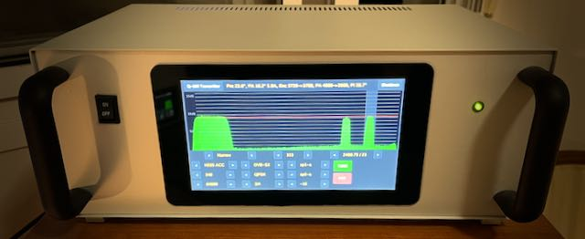

# Q-100 Transmitter
### Control and monitor a DATV transmiter with a touch screen.

### REQUIRES Raspberry PI OS (64-BIT) - the Bookworm Desktop version

## Hardware
- Raspberry Pi 4B with 4GB RAM (minimum)
- Raspberry Pi Official 7" Touch Screen
- Analog Devices PlutoSDR Revision D
- Analog Devices HMC349 RF Switch 
- Analog Devices EVAL-CN0417-EBZ 2.4GHz RF Power Amplifier
- EA7KIR TX Remote PCB
- DDMALL HEV-10 HDMI Video Encoder
- AXIS Electronics AX88772 Ethernet to USB adapter 
- Requires the paserver to live on the LAN

## Connections
- 5 volt supply to Encoder and Raspberry Pi
- HDMI video to Encoder connector
- LAN to Raspberry Pi RJ45 connector
- Encoder RJ45 to ethnernet/usb adpater
- ethnernet/usb adpater to bottom Raspberry Pi USB3 connector
- Pluto middle USB to top Raspberry Pi USB3 connector (yes, Pluto is powered from RPI)
- GPIO to TX Remote PCB
- GPIO to HMC349 RF Switch

## Installing
**A keyboard and mouse are not required at any time**

### Using Raspberry Pi Imager v1.8.5:
```
CHOOSE Raspberry Pi Device: Raspberry Pi 4 

CHOOSE Operating Sysytem: Raspberry Pi OS (64-bit)

CONFIGURE:
	Set hostname:			txtouch
	Enable SSH
		Use password authentication
	Set username and password
		Username:			pi
		Password: 			<password>
	Set locale settings
		Time zone:			<Europe/Madrid> # or wherever you are
		Keyboard layout:	<us>
	Eject media when finished
SAVE and WRITE
```

Insert the card into the Raspberry Pi and switch on

WARNING: the Pi may reboot during the install, so please allow it to complete

### Remote login from a Mac, PC or Linux host
```
ssh pi@txtouch.local

mkdir /home/pi/Q100
cd /home/pi/Q100
git clone https://github.com/ea7kir/q100transmitter.git
chmod +x /home/pi/Q100/q100transmitter/etc/install.sh
/home/pi/Q100/q100transmitter/etc/install.sh
```
### After rebboting
Use your finger to configure some Desktop settings:
```
Appearance Settings
    Disable Wastebasket & External Disks
Raspberry Pi Configuration
    System set Network at Boot to ON
```
Login from a PC, Mac, or Linux and login to the Pluto to authenticate and exit
```
ssh pi@txtouch.local
ssh root@192.168.2.1 # password 'analog' and 'exit'
exit
```
```
cd Q100/q100transmitter
go mod tidy
go build --tags nox11 .
sudo systemctl enable q100transmitter
sudo systemctl start q100transmitter
```

## License
Copyright (c) 2023 Michael Naylor EA7KIR (https://michaelnaylor.es)

This program is free software: you can redistribute it and/or modify it under the terms of the GNU General Public License as published by the Free Software Foundation, either version 3 of the License, or (at your option) any later version.

This program is distributed in the hope that it will be useful, but WITHOUT ANY WARRANTY; without even the implied warranty of MERCHANTABILITY or FITNESS FOR A PARTICULAR PURPOSE. See the GNU General Public License for more details.

You should have received a copy of the GNU General Public License along with this program. If not, see https://www.gnu.org/licenses/.
